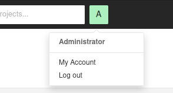

### Prerequisites

- Docker
- Docker-compose 3.9

## Project structure

Here is a preview of project tree :

```
sonarQubeGreenIt      
| 
+--native-analyzer      # Root directory of "native" linter
|  |
|  +--android-plugin    # Android
|  |
|  +--java-plugin       # JAVA
|  |
|  +--php-plugin        # PHP
|  |
|  \--python-plugin     # Python
|
\--docker-compose.yml   # Docker compose file installing available analyzer // TODO
```

You can find more information about plugins’ architecture in there folders


## Howto install SonarQube dev environment

### Init

Run the stack 
```sh 
docker-compose up --build -d
```

If you have this error on run

`web_1  | [1]: max virtual memory areas vm.max_map_count [65530] is too low, increase to at least [262144]`

You can allow more virtual memory :

```sh
sudo sysctl -w vm.max_map_count=262144
```

Go to http://localhost:9000 and use these credentials :
```
login: admin
password: admin
```

When you are connected, generate a new token :

`My Account -> Security -> Generate Tokens`




Start again your services using the token :

```sh
TOKEN=MY_TOKEN docker-compose up --build -d
```


### Plugins import

#### Native analyzer

They will be direcly imported if you did [installation](native-analyzer/INSTALL.md) for each


