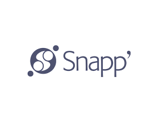
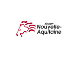

# ecoCode Android SonarQube plugin


ecoCode Android SonarQube plugin is an "eco-responsibility" static code analyzer for native Android projects written in Java (Kotlin unsupported yet). Its aim is to detect code smells to indicate weither the source code can be improved to reduce their environmental and social impact.

## Screenshot

We are currently working on a custom UI for the plugin. You can see the new user-friendly dashboard below.

 **Warning**: This UI is not released on open source.
 
 


## Build and deploy the plugin

### Prerequisites

## Maven

This project is driven by maven so this is a required tool.

Use homebrew to install mvn:

```sh
brew install maven
```

### Plugin tests

The basic command line to run all tests is:

```sh
mvn test
```

To run a single test:

```sh
mvn -Dtest=FusedLocationCheckTest test
```

where `FusedLocationCheckTest` is the test to run.

Tests are located under:

- [/src/test/java/io/ecocode/java](/src/test/java/io/ecocode/java)
- [/src/test/java/io/ecocode/xml](/src/test/java/io/ecocode/xml)

### Plugin build

Build CodeNarc (gradle 6.5.1, Java 14):

```sh
gradle build -x test 
```

Add custom CodeNarc to Maven dependencies:

```sh
cd /codenarc-converter
mvn initialize
```

Build codenarc-converter:

```sh
cd /codenarc-converter
mvn clean package
```

Build android-plugin:

```sh
cd /android-plugin
mvn clean package
```

### Local deployment using docker

**This implies to have a machine ready to run containerized applications.** Please refer to Docker documentation: https://www.docker.com/.

The project uses a 8.6 docker instance of SonarQube to run.

Pop docker containers by using:

```sh
docker-compose up --build -d && docker ps
```

The tests instance of SonarQube with the plugin will then be available at: http://localhost:9000  (admin / admin)

## Plugin usage

The plugin contains two sets of rules, one for Java and one for XML. They can be found in the **Quality profiles** section of
SonarQube (*ecoCode* profiles).
Do not forget to set them as "DEFAULT" or to configure your Android project on SonarQube to use these profiles before performing an
analysis.

When done, just use SonarQube as you normally do for your classical Android clean code analysis.

## Plugin development

### Plugin architecture

For Java rules:

- Java rules’ code can be found in: [/src/main/java/io/ecocode/java](/src/main/java/io/ecocode/java)
- Java rules’ definition can be found in: [/src/main/resources/org/sonar/l10n/java/rules/squid](/src/main/resources/org/sonar/l10n/java/rules/squid).
  Please do not add / or modify rules here since the code is generated. To update or add a rule, please reach us though our mail
  <contact@ecocode.io>, prior to submitting any code change.
- Java rules’ tests can be found in: [/src/test/java/io/ecocode/java](/src/test/java/io/ecocode/java). One file = one rule.

For XML rules:

- XML rules’ code can be found in: [/src/main/java/io/ecocode/xml](/src/main/java/io/ecocode/xml)
- XML rules’ definition can be found in: [/src/main/resources/io/ecocode/xml/rules](/src/main/resources/io/ecocode/xml/rules).
  Please do not add / or modifiy rules here since the code is generated. To update or add a rule, please reach us though our mail
  <contact@ecocode.io>, prior to submitting any code change.
- XML rules’ tests can be found in: [/src/test/java/io/ecocode/xml](/src/test/java/io/ecocode/xml). One file = one rule.

## Partners
[](https://www.snapp.fr)
[](https://www.univ-pau.fr/)
[](https://www.nouvelle-aquitaine.fr)
[](https://collectif.greenit.fr)

## License

Licensed under the [GNU Lesser General Public License, Version 3.0](https://www.gnu.org/licenses/lgpl.txt)
